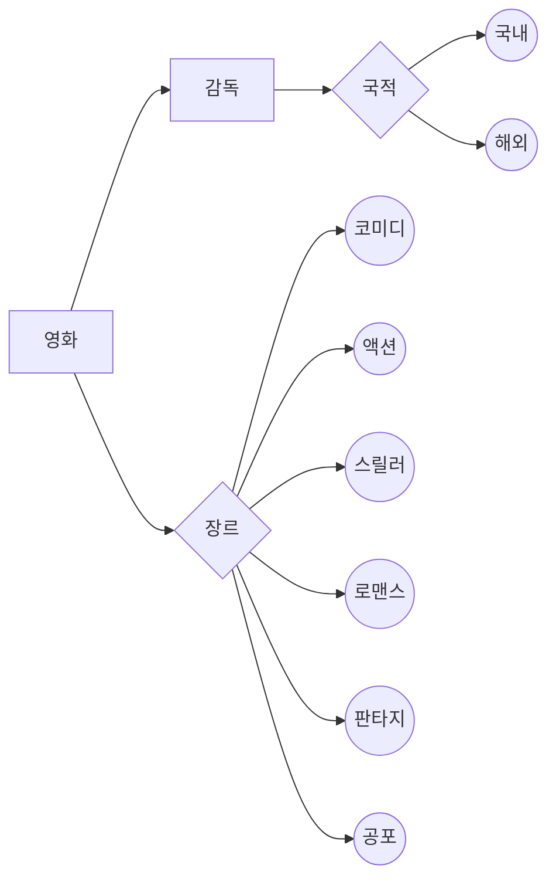

# 영화 탐색 데이터베이스
> **영화**에 대한 간략한 줄거리, 감독, 평점, 수상내역 등을 탐색이 가능한 데이터베이스
___
* 사용언어: java
* 사용 데이트베이스: mySQL
___
### 예시
| 영화번호 |제목 | 감독 | 줄거리 | 국적 | 장르  |
| ------ | ------ | ------ | ------ | ------ | ------ |
| 01 |조디악 | 데이비드 핀처 | 미국의 연쇄살인마 조디악 킬러에 관한 영화 | 해외 | 스릴러 |
| 02 |기생충 | 봉준호 | 한 쪽은 부유한, 한 쪽은 가난한, 두 가족을 중심으로 펼쳐지는 이야기  | 국내 | 코미디, 스릴러 |
___
### 사용 예시
* 장르가 스릴러인 영화들을 검색 후 정렬 
   > select 스릴러 from table order by 제목
* 봉준호 감독의 영화들을 검색 후 정렬
  > select 봉준호 from table order by 제목
* 영화번호 추가 후 기본키로 설정
 > ADD 영화번호 int PRIMARY KEY
___
### 개체-관계 데이트그램(ER) 모델

___
### 기록
> 1주차: mySQL 설치
> 
> 2주차: 주제 선정 및 README 파일 작성
> 
> 3주차: 데이터베이스 구상
> 4주차: 개체-관계 데이터그램(ER) 모델 작성
> 5주차: 기본키(영화번호) 설정
