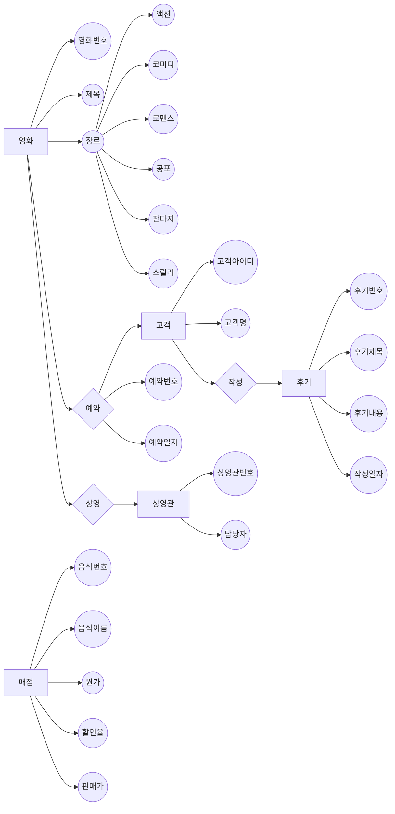

# 영화관 데이터베이스
> **영화관**을 전산상에서 실제로 구현해본 데이터베이스
___
* 사용언어: c++
* 사용 데이트베이스: Oracle
___
>### 요구사항 명세서

1. 영화관에 찾아온 고객들은 영화를 보기 위해서 고객 아이디와 고객 명을 입력해야 한다.
2. 고객들은 고객 아이디로 식별이 된다.
3. 영화관에 등록되어 있는 영화들은 영화 번호와 영화 제목, 장르가 입력되어져 있다.
4. 각 영화들은 영화 번호로 식별이 된다.
5. 영화의 장르는 액션, 코미디, 로맨스, 공포, 판타지, 스릴러로 구분이 가능하다.
6. 한 명의 고객이 여러가지 영화를 예약할 수 있고, 하나의 영화를 여러 명의 고객이 예약할 수 있다.
7. 고객이 영화를 예약하면, 영화에 대한 예약 번호, 예약 일자 정보를 유지해야 한다.
8. 영화관에는 영화가 상영되는 상영관이 존재한다.
9. 상영관은 상영관 번호로 식별되고, 각 상영관에는 담당자가 존재한다.
10. 한 상영관에 담당자가 두 명 이상이 존재할 수도 있다.
11. 한 상영관에는 한 개의 영화만이 상영이 된다.
12. 고객은 여러가지 후기를 작성이 가능하나, 후기 하나는 한 명의 고객만 작성이 가능하다.
13. 후기에 대한 후기 번호, 후기 제목, 후기 내용, 작성 일자 정보를 유지해야 한다.
14. 후기는 후기 번호로 식별이 된다. 
15. 영화관에는 음식을 판매하는 매점이 존재한다.
16. 매점에 음식을 등록하려면 음식 번호, 음식 이름, 원가, 할인율, 판매가를 입력해야 한다.
17. 음식은 음식 번호로 식별이 된다.
18. 음식의 판매가는 원가에 할인율이 적용된 가격이다.
___
>### 개체-관계 데이트그램(ER) 모델

___
>### 테이블
