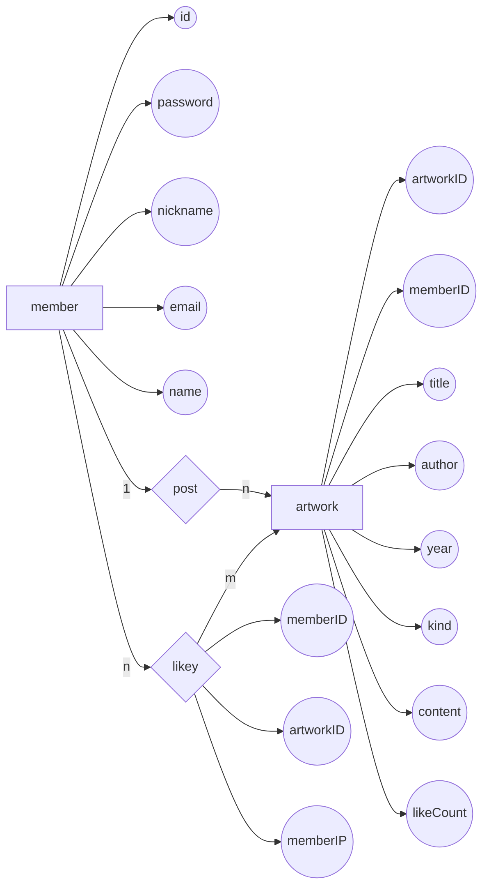

# FindMedia 데이터베이스
* 사용언어: Java
* 사용 데이트베이스: mySQL
___
>### 프로젝트 주제 설명
&nbsp;FindMedia는 같은 작품을 원작으로 한 여러가지 미디어 믹스들을 한 눈에 볼 수 있고 그것들에 관한 평가를 서로서로 공유할수 있는 서비스를 제공하는 웹 사이트이다.  
데이터베이스로서는 mysql을 사용하였고, 프론트 엔드는 자바 스크립트, css와 부트스트랩을 사용하여 디자인하였고, 백 엔드 같은 경우에는 mvc2방식으로 구현했다.
mysql 에 findmedia라는 이름의 데이터베이스를 만들고, 그 안에 artwork, likey, member 라는 총 세가지의 테이블을 생성했습니다.   
이름에서부터 알 수 있듯이, artwork는 등록작품들을 저장하는 데이터베이스이고, lieky는 사용자가 등록한 평가에 다른 사용자가 추천을 누르는 과정에서 어떤 사용자가 어떤 게시글에 추천을 눌렀는지를 저장하는 데이터베이스이다. member데이터베이스 역시 이름에서부터도 알수 있듯이 회원정보를 저장하는 데이터베이스입니다.  
첫 페이지인 index.jsp 에서 대부분의 기능이 이루어지게 설계하였다.  
index.jsp에서 사용이 가능한 기능으로는 로그인, 회원가입, 회원탈퇴, 로그아웃, 작품 등록, 작품 검색, 작품 정렬, 등록 작품 추천 등이 있다.  
작품 등록 같은 경우에는 5개 이상의 작품이 등록될때마다 페이지가 넘어간다.  
검색바를 활용하여 작품을 최신순과 추천순 차순으로 정렬하는 기능 또한 추가하였습니다.  
분류를 활용하여, 같은 제목을 포함한 작품들을 조회하여 다른 방식으로 재해석된 같은 원작의 작품들을 만나볼 수 있다.  
또한, 작품 추천 같은 경우는 한 사용자가 하나의 글에 한개의 추천만을 할 수 있도록 설계하였고, 작품 삭제 같은 경우에는 그 게시글을 등록한 사용자만이 그 글을 삭제할 수 있도록 설계하였다.
login.jsp로 넘어갔을 때 사용 가능한 기능으로는 아이디와 비밀번호 찾기 기능이 있다.  
아이디를 찾기 위해서는 가입했을 때 사용한 이메일이 필요하고, 비밀번호를 찾기 위해서는 아이디와 이메일 두 가지가 요구된다.  
회원탈퇴 기능같은 경우에는 가입했을때 기입한 모든 요소를 정확하게 입력하여야 탈퇴가 이루어진다.     
&nbsp;
>### 프로젝트 파일 구성 설명
&nbsp;Webcontent 폴더안의 css, image, js 폴더는 프론트 엔드 작업을 위하여 필요한 파일들을 모아놓은 폴더들이다.  
image 폴더 같은 경우에는 로고 등의 이미지 요소들이 포함 되어있다.  
result폴더에는 아이디 찾기/ 비밀번호 찾기를 눌렀을때 표시되는 창들을 저장해 놓았다.  
백 엔드 작업 같은 경우에는 전부 mvc2작업을 방식을 택했기에, 웹 서비스를 가동시키고 브라우저에서 작업을 요청하면 모든 명령이 src폴더 안, controller 패키지 안의 FrontController에게로 갈 수 있게 web.xml에서 설계를 해놓았다.  
FrontController에서 요청을 받으면 hash map을 이용하여 실체 처리가 이루어지는 클래스(DeleteController, FindIDController, LogfinController 등 FrontController 이외의 컨트롤러들) 로 작업을 이전된다.  
이전된 곳에서의 작업이 이루어지는 과정에서 각각의 맞는 DTO,DAO,Service 클래스들이 사용이 되어진다.  
요청된 작업이 이루어지면 자바스크립트를 사용해 알림창이 띄워지거나, 다른 페이지로 이동이 되게 설계를 해놓았다.  
&nbsp;
___
>### 요구사항 명세서  
__1.__ FindMedia에 작품을 등록하려면 member가 되어야 한다.  
__2.__ member가 되기 위해서는 FindMedia에 회원가입을 해야 한다.  
__3.__ 회원가입을 하기 위해서는 member의 id, password, nickname, email, name 정보를 입력해야 한다.  
__4.__ member들은 id로 식별이 된다.  
__5.__ FindMedia에 등록되는 artwork 들은 artworkID, memberID, title(작품 제목), author(원작자), year(제작 연도), kind(분류), content(내용), score(평점), likeCount 정보가 입력되어져 있다.  
__6.__ 각 artwork 들은 artworkID로 식별이 된다.  
__7.__ 한명의 member가 여러가지 artwork를 등록(post)이 가능하고, 하나의 artwork을 여러가지 member가 등록(post)이 가능하다.  
__8.__ member은 여러가지 artwork에 추천(likey)를 누르는 것이 가능하다.  
__9.__ artwork 입장에서는 여러 member이 추천(likey)을 누르는 것이 가능하다.  
__10.__ member가 artwork에 추천(likey)을 누르면, 추천을 누른 member의 memberID와 memberIP, 추천이 눌러진 artworkID 정보가 유지되어야 한다.   
&nbsp;
___
>### 개체, 속성, 관계 분류
__개체:__ member, artwork
__속성:__ id, password, nickname, email, name, artworkID, memberID, title(작품 제목), author(원작자), year(제작 연도), kind(분류), content(내용), score(평점), likeCount, memberID, memberIP, artworkID
__관계:__ post(등록), likey(추천)
&nbsp;
___
>### 개체-관계 데이트그램(ER) 모델

&nbsp;
___
>### 릴레이션 스키마
member(__id__, password, nickname, email, name)  
artwork(__artworkID__, memberID, title, author, year, kind, content, score, likeCount)  
likey(__memberID__, artworkID, memberIP)  
&nbsp;
___
>### 테이블 명세서
__<member 테이블 명세서>__
|Field|Type|Null|Key|Default|Extra|
|---|---|---|---|---|---|
|id|varchar(20)|NO|PRI|NULL| |
|password|varchar(20)|NO||NULL| |
|nickname|varchar(10)|NO||NULL| | 
|email|varchar(40)|YES||NULL| | 
|name|varchar(10)|NO||NULL| |

&nbsp;
&nbsp;

__<artwork 테이블 명세서>__
|Field|Type|Null|Key|Default|Extra|
|---|---|---|---|---|---|
|artworkID|int|NO|PRI|NULL|auto_increment|
|memberID|varchar(20)|NO||NULL| |
|title|varchar(20)|NO||NULL| | 
|author|varchar(20)|YES||NULL| | 
|year|int|YES||NULL| |
|kind|varchar(20)|YES||NULL| |
|content|varchar(4000)|YES||NULL| |
|score|varchar(10)|YES||NULL| |
|likeCount|int|YES||NULL| |

&nbsp;
&nbsp;

__<likey 테이블 명세서>__
|Field|Type|Null|Key|Default|Extra|
|---|---|---|---|---|---|
|memberID|varchar(20)|NO|PRI|NULL| |
|artworkID|int|NO|PRI|NULL| |
|memberIP|varchar(10)|YES||NULL| | 

&nbsp;
&nbsp;
___
>### 데이터베이스 테이블 생성 스크립트  
&nbsp;
___
>### 정규화 과정  

