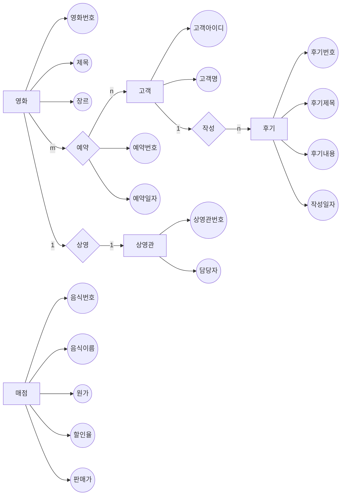

# 영화관 데이터베이스
> **영화관**을 전산상에서 실제로 구현해본 데이터베이스
___
* 사용언어: c++
* 사용 데이트베이스: Oracle
___
>### 요구사항 명세서

1. 영화관에 찾아온 고객들은 영화를 보기 위해서 고객 아이디와 고객 명을 입력해야 한다.
2. 고객들은 고객 아이디로 식별이 된다.
3. 영화관에 등록되어 있는 영화들은 영화 번호와 영화 제목, 장르가 입력되어져 있다.
4. 각 영화들은 영화 번호로 식별이 된다.
5. 한 명의 고객이 여러가지 영화를 예약할 수 있고, 하나의 영화를 여러 명의 고객이 예약할 수 있다.
6. 고객이 영화를 예약하면, 영화에 대한 예약 번호, 예약 일자 정보를 유지해야 한다.
7. 영화관에는 영화가 상영되는 상영관이 존재한다.
8. 상영관은 상영관 번호로 식별되고, 각 상영관에는 담당자가 존재한다.
9. 한 상영관에 담당자가 두 명 이상이 존재할 수도 있다.
10. 한 상영관에는 한 개의 영화만이 상영이 된다.
11. 고객은 여러가지 후기를 작성이 가능하나, 후기 하나는 한 명의 고객만 작성이 가능하다.
12. 후기에 대한 후기 번호, 후기 제목, 후기 내용, 작성 일자 정보를 유지해야 한다.
13. 후기는 후기 번호로 식별이 된다. 
14. 영화관에는 음식을 판매하는 매점이 존재한다.
15. 매점에 음식을 등록하려면 음식 번호, 음식 이름, 원가, 할인율, 판매가를 입력해야 한다.
16. 음식은 음식 번호로 식별이 된다.
17. 음식의 판매가는 원가에 할인율이 적용된 가격이다.
___
>### 개체, 속성, 관계 분류
>_개체_: 고객, 영화, 상영관, 후기, 매점  
>_속성_: 고객 아이디, 고객명, 영화 번호, 영화 제목, 장르, 예약 번호, 예약 일자, 상영관 번호, 담당자, 후기 번호, 후기 제목, 후기 내용, 작성 일자, 음식번호, 음식이름, 원가, 할인율, 판매가  
>_관계_: 예약, 상영, 작성

___
>### 개체-관계 데이트그램(ER) 모델

___
>### 릴레이션 스키마

영화 릴레이션(__영화번호__, 영화제목, 장르, 상영관번호)  
상영관 릴레이션(__상영관번호__, 영화번호)  
상영관-담당 릴레이션(__상영관번호__, 담당자)  
예약 릴레이션(__예약번호__, 영화번호, 상영관번호, 예약일자)  
고객 릴레이션(__고객아이디__, 고객명)  
후기 릴레이션(__후기번호__, 후기제목, 후기내용, 작성일자, 고객아이디)  
매점 릴레이션(__음식번호__, 음식이름, 원가, 할인율, 판매가)
___
>### 테이블 명세서

<영화 테이블 명세서>
|속성 이름|데이터 타입|널 허용 여부|기본값|기본키|외래키|제약조건|
|------|---|---|---|---|---|---|
|영화번호|int|N|---|PK|---|---|
|영화제목|varchar(20)|N|---|---|---|---|
|장르|varchar(10)|Y|---|---|---|---|
|상영관번호|int|N|---|---|---|---|

<상영관 테이블 명세서>
|속성 이름|데이터 타입|널 허용 여부|기본값|기본키|외래키|제약조건|
|------|---|---|---|---|---|---|
|상영관번호|int|N|---|PK|---|---|
|영화번호|int|N|---|---|---|---|

<상영관-담당자 테이블 명세서>
|속성 이름|데이터 타입|널 허용 여부|기본값|기본키|외래키|제약조건|
|------|---|---|---|---|---|---|
|상영관번호|int|N|---|PK|FK|---|
|담당자|varchar(10)|Y|---|PK|---|---|

<예약 테이블 명세서>
|속성 이름|데이터 타입|널 허용 여부|기본값|기본키|외래키|제약조건|
|------|---|---|---|---|---|---|
|예약번호|int|N|---|PK|---|---|
|영화번호|int|N|---|---|FK|---|
|상영관번호|int|N|---|---|FK|---|
|예약일자|date|Y|---|---|---|---|

<고객 테이블 명세서>
|속성 이름|데이터 타입|널 허용 여부|기본값|기본키|외래키|제약조건|
|------|---|---|---|---|---|---|
|고객아이디|varchar(10)|N|---|PK|---|---|
|고객명|varchar(10)|N|---|---|---|---|

<후기 테이블 명세서>
|속성 이름|데이터 타입|널 허용 여부|기본값|기본키|외래키|제약조건|
|------|---|---|---|---|---|---|
|후기번호|int|N|---|PK|---|---|
|후기제목|varchar(10)|N|---|---|---|---|
|후기내용|varchar(100)|Y|---|---|---|---|
|작성일자|date|Y|---|---|---|---|
|고객아이디|varchar(10)|N|---|---|FK|---|

<매점 테이블 명세서>
|속성 이름|데이터 타입|널 허용 여부|기본값|기본키|외래키|제약조건|
|------|---|---|---|---|---|---|
|음식번호|int|N|---|PK|---|---|
|음식이름|varchar(10)|N|---|---|---|---|
|원가|int|Y|---|---|---|---|
|할인율|int|Y|---|---|---|---|
|판매가|int|Y|---|---||---|

___
>### 데이터베이스 테이블 생성 스크립트  
  
create table 영화(  
   영화번호 int not null,  
   영화제목 varchar(20) not null,  
   장르 varchar(10),  
   상영관번호 int not null,  
   primary key(영화번호)  
   );    
   
create table 상영관(  
   상영관번호 int not null,  
   영화번호 int not null,  
   primary key(상영관번호)  
   );  
  
create table 상영관-담당자(  
   상영관번호 int not null,  
   담당자 varchar(10),  
   primary key(상영관번호, 담당자),  
   foreign key(상영관번호) references 상영관(상영관번호)  
   );  
   
create table 예약(  
   예약번호 int not null,  
   영화번호 int not null,  
   상영관번호 int not null,  
   예약일자 date,  
   primary key(예약번호),  
   foreign key(영화번호) references 영화(영화번호)  
   foreign key(상영관번호) references 상영관(상영관번호)  
   );  
   
create table 고객(    
   고객아이디 varchar(10) not null,  
   고객명 varchar(10) not null,  
   primary key(고객아이디)  
   );  
   
create table 후기(  
   후기번호 int not null,  
   후기제목 varchar(10) not null,  
   후기내용 vharchar(100),  
   작성일자 date,  
   고객아이디 varchar(10) not null,  
   primary key(후기번호)  
   foreign key(고객아이디) references 고객(고객아이디)  
   );  
   
create table 매점(  
   음식번호 int not null,  
   음식이름 varchar(10) not null,  
   원가 int,  
   할인율 int,  
   판매가 int,  
   primary key(음식번호)  
   );  
   
___
>### 정규화 과정  

정규화는 데이터 베이스를 설계한 후에 설계 결과물을 검증하기 위해 사용하는 방법이다.  
정규화에는 제1정규화, 제2정규화, 제3정규화, 보이스/코드 정규화 (BCNF), 제4, 제5 정규화 등의 여러가지 종류의 정규화들이 존재한다. 

먼저 1차 정규화를 영화관 데이터베이스에서 영화 릴레이션을 예시로서 적용해보겠다.  
>  
<기존 영화 테이블>
|영화번호|영화제목|장르|상영관번호|
|---|---|---|---|
|1|킬빌|액션|1|
|2|올드보이|액션,스릴러|2|
|3|기생충|코미디, 스릴러|3|
|4|반지의제왕|판타지|4|
|5|곤지암|공포|5|
>  
>1차 정규형은 릴레이션에 속한 모든 속성의 도메인이 원자 값, 즉 한개의 값으로만 구성이 되어야한다.
고로 1차 정규화를 적용하면 영화 테이블은 아래와 같이 변하게 된다.
>  
<1차 정규형 영화 테이블>
|영화번호|영화제목|장르|상영관번호|
|---|---|---|---|
|1|킬빌|액션|1|
|2|올드보이|액션|2|
|2|올드보이|스릴러|2|
|3|기생충|코미디|3|
|3|기생충|스릴러|3|
|4|반지의제왕|판타지|4|
|5|곤지암|공포|5|
>  
>1차 정규화를 하였지만 불필요한 데이터 중복이 발생한다.  
>이를 해결하기 위해서 부분 함수 종속을 제거하고 모든 속성이 기본키에 완전 함수 종속되도록 하는 정규화 과정인 제 2정규화를 실행해야 한다.  
>제 2정규화를 하기 위해서 영화 테이블을 영화 테이블과 장르 테이블 두개의 테이블로 쪼개었다.  
>  
<2차 정규형 영화 테이블>
|영화번호|영화제목|상영관번호|
|---|---|---|
|1|킬빌|액션|1|
|2|올드보이|2|
|3|기생충|3|
|4|반지의제왕|4|
|5|곤지암|5|
>  
<2차 정규형 영화 장르 테이블>
|영화번호|장르|
|---|---|
|1|액션|
|2|액션|
|2|스릴러|
|3|코미디|
|3|스릴러|
|4|판타지|
|5|공포|
>  
>대개의 릴레이션은 2차 정규화까지만을 해도 이상이 발생하지 않지만 종종 복잡한 릴레이션의 경우 갱신 이상이 발생하기도 한다.  
>이러한 경우를 해결하기 위해 존재하는 것이 제 3차 정규화이다.  
>제 3차 정규화를 간단하게 설명하자면 기본키 이외의 속성이 다른 속성에게 영향을 주지 못하게 하는 것이다.  
>제 3차 정규화를 적용가능한 테이블로 매점 테이블을 들 수가 있다.  
>  
<기존 매점 테이블>
|음식번호|음식이름|원가|할인율|판매가|
|---|---|---|---|---|
|1|빵|100|10|90|
|2|스파게티|1000|20|800|
|3|라면|500|5|475|
>  
>매점 테이블을 보자면, 매점 릴레이션의 기본키는 음식번호인데 기본키가 아닌 원가와 할인율 또한 판매가 속성에 영향을 주고 있다.  
>이와 같은 이행적 함수 종속을 없애기 위해서는 2차 정규화와 마찬가지로 테이블을 분리하면 된다.  
>  
<3차 정규화 매점 테이블>
|음식번호|음식이름|원가|할인율|
|---|---|---|---|
|1|빵|100|10|
|2|스파게티|1000|20|
|3|라면|500|5|
>  
<3차 정규화 매점 원가 할인율 테이블>
|원가|할인율|판매가|
|---|---|---|
|100|10|90|
|1000|20|800|
|500|5|475|
>  
>마지막으로 BCNF는 3차 정규화를 조금 더 강화했다고 볼 수 있는 정규화의 일종이다.  
>3차 정규화를 강화했기 때문에 3차 정규화로는 해결할 수 없었던 이상현상을 해결하는 것이 가능하다.  
>BCNF는 3차 정규형을 만족하면서 모든 결정자가 후보키에 속하는 정규형이다.   
>BCNF를 위반하는 사례는 거의 존재하지 않지만 굳이 예시를 들어보자면 예약 테이블을 예시로서 들어보겠다.  
>이때 하루에 한개의 상영관에서 한개의 영화만이 상영된다고 가정한다.
>  
<기존 예약 테이블>
|예약번호|영화번호|상영관번호|예약일자|
|------|---|---|---|
|1|기생충|1|20220607|
|2|올드보이|2|20220609|
|3|반지의제왕|3|20220610|
>  
>후보키는 슈퍼키의 집합에서 최소성을 만족하는 이들의 집합이기 때문에, 예약 테이블에서는 예약번호, 영화번호, 상영관번호 세가지 속성은 후보키가 될 수 있으나, 예약일자는 후보키가 아닌 결정자가 된다.  
>이를 분해하기 위해서는 제 2, 제 3 정규화 과정에서 그랬던 것과 마찬가지로 테이블을 분리하면 된다.  
>  
<BCNF 예약 테이블>
|예약번호|영화번호|상영관번호|
|---|---|---|
|1|기생충|1|
|2|올드보이|2|
|3|반지의제왕|3|
>  
<BCNF 예약 예약일자 테이블>
|예약일자|상영관번호|
|---|---|
|20220607|기생충|
|20220609|올드보이|
|20220610|반지의제왕|
>  
