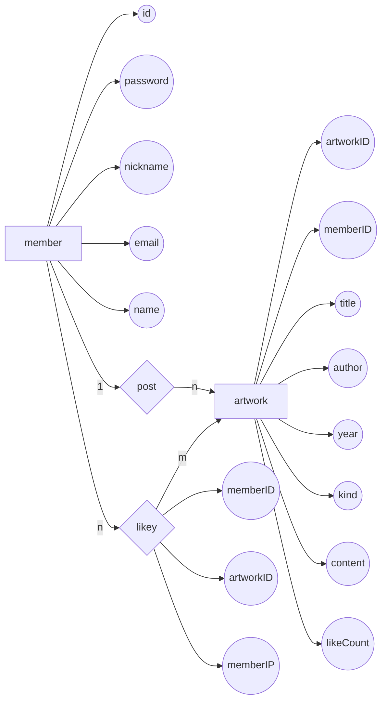

# FindMedia 데이터베이스
* 사용언어: Java
* 사용 데이트베이스: mySQL
___
>### 프로젝트 주제 설명
&nbsp;FindMedia는 같은 작품을 원작으로 한 여러가지 미디어 믹스들을 한 눈에 볼 수 있고 그것들에 관한 평가를 서로서로 공유할수 있는 서비스를 제공하는 웹 사이트이다.  
데이터베이스로서는 mysql을 사용하였고, 프론트 엔드는 자바 스크립트, css와 부트스트랩을 사용하여 디자인하였고, 백 엔드 같은 경우에는 mvc2방식으로 구현했다.
mysql 에 findmedia라는 이름의 데이터베이스를 만들고, 그 안에 artwork, likey, member 라는 총 세가지의 테이블을 생성했다.  
이름에서부터 알 수 있듯이, artwork는 등록작품들을 저장하는 데이터베이스이고, lieky는 사용자가 등록한 평가에 다른 사용자가 추천을 누르는 과정에서 어떤 사용자가 어떤 게시글에 추천을 눌렀는지를 저장하는 데이터베이스이다. member 데이터베이스 역시 이름에서부터도 알수 있듯이 회원정보를 저장하는 데이터베이스이다.  
첫 페이지인 index.jsp 에서 대부분의 기능이 이루어지게 설계하였다.  
index.jsp에서 사용이 가능한 기능으로는 로그인, 회원가입, 회원탈퇴, 로그아웃, 작품 등록, 작품 검색, 작품 정렬, 등록 작품 추천 등이 있다.  
작품 등록 같은 경우에는 5개 이상의 작품이 등록될때마다 페이지가 넘어간다.  
검색바를 활용하여 작품을 최신순과 추천순 차순으로 정렬하는 기능 또한 추가하였다.  
분류를 활용하여, 같은 제목을 포함한 작품들을 조회하여 다른 방식으로 재해석된 같은 원작의 작품들을 만나볼 수 있다.  
또한, 작품 추천 같은 경우는 한 사용자가 하나의 글에 한개의 추천만을 할 수 있도록 설계하였고, 작품 삭제 같은 경우에는 그 게시글을 등록한 사용자만이 그 글을 삭제할 수 있도록 설계하였다.
login.jsp로 넘어갔을 때 사용 가능한 기능으로는 아이디와 비밀번호 찾기 기능이 있다.  
아이디를 찾기 위해서는 가입했을 때 사용한 이메일이 필요하고, 비밀번호를 찾기 위해서는 아이디와 이메일 두 가지가 요구된다.  
회원탈퇴 기능같은 경우에는 가입했을때 기입한 모든 요소를 정확하게 입력하여야 탈퇴가 이루어진다.     
&nbsp;
>### 프로젝트 파일 구성 설명
&nbsp;Webcontent 폴더안의 css, image, js 폴더는 프론트 엔드 작업을 위하여 필요한 파일들을 모아놓은 폴더들이다.  
image 폴더 같은 경우에는 로고 등의 이미지 요소들이 포함 되어있다.  
result폴더에는 아이디 찾기/ 비밀번호 찾기를 눌렀을때 표시되는 창들을 저장해 놓았다.  
백 엔드 작업 같은 경우에는 전부 mvc2작업을 방식을 택했기에, 웹 서비스를 가동시키고 브라우저에서 작업을 요청하면 모든 명령이 src폴더 안, controller 패키지 안의 FrontController에게로 갈 수 있게 web.xml에서 설계를 해놓았다.  
FrontController에서 요청을 받으면 hash map을 이용하여 실체 처리가 이루어지는 클래스(DeleteController, FindIDController, LogfinController 등 FrontController 이외의 컨트롤러들) 로 작업을 이전된다.  
이전된 곳에서의 작업이 이루어지는 과정에서 각각의 맞는 DTO,DAO,Service 클래스들이 사용이 되어진다.  
요청된 작업이 이루어지면 자바스크립트를 사용해 알림창이 띄워지거나, 다른 페이지로 이동이 되게 설계를 해놓았다.  
&nbsp;
___
>### 요구사항 명세서  
__1.__ FindMedia에 작품을 등록하려면 먼저 FindMedia의 member가 되어야 한다.  
__2.__ member가 되기 위해서는 FindMedia에 회원가입을 해야 한다.  
__3.__ 회원가입을 하기 위해서는 member의 id, password, nickname, email, name 정보를 입력해야 한다.  
__4.__ member들은 id로 식별이 된다.  
__5.__ 회원가입을 할 때, member의 email 정보는 빈칸이 입력이 되어도 상관 없다.  
__6.__ FindMedia에 member가 artwork를 등록할 때, artwork에 대한 artworkID, memberID(artwork를 등록한 member의 ID), title(작품 제목), author(원작자), year(제작 연도), kind(분류), content(내용), score(평점)가 입력되어져야 한다.  
__7.__ artwork는 artworkID로 식별이 되는데, artworkID는 직접 입력하지 않아도 자동으로 1부터 시작해서 1씩 증가하면서 입력이 된다.  
__8.__ member가 artwork를 등록할 때, title(작품 제목)은 빈칸으로 두면 안되나, author(원작자), year(제작 연도), kind(분류), content(내용), score(평점) 들은 빈칸으로 설정해도 등록은 가능하다.  
__9.__ 한명의 member가 여러가지 artwork를 등록(post)이 가능하고, 하나의 artwork을 여러가지 member가 등록(post)이 가능하다.  
__10.__ member은 여러가지 artwork에 추천(likey)를 누르는 것이 가능하다.  
__11.__ artwork 입장에서는 여러 member이 추천(likey)을 누르는 것이 가능하다.  
__12.__ member가 artwork에 추천(likey)을 누르면, artwork의 likeCount가 1 오르게 되고, likey에 대해서 추천을 누른 member의 memberID와 memberIP, 추천이 눌러진 artworkID 정보가 유지되어야 한다.   
__13.__ likey는 어떤 사용자가 (memberID) 어떤 게시글을 (artworkID)를 눌렀는지에 따라서 식별이 된다.  
&nbsp;
___
>### 개체, 속성, 관계 분류
__개체:__ member, artwork  
__속성:__ id, password, nickname, email, name, artworkID, memberID, title(작품 제목), author(원작자), year(제작 연도), kind(분류), content(내용), score(평점), likeCount, memberID, memberIP, artworkID  
__관계:__ post(등록), likey(추천)  
&nbsp;
___
>### 개체-관계 데이트그램(ER) 모델

&nbsp;
___
>### 릴레이션 스키마
member(__id__, password, nickname, email, name)  
artwork(__artworkID__, memberID, title, author, year, kind, content, score, likeCount)  
likey(__memberID__, __artworkID__, memberIP)  
&nbsp;
___
>### 테이블 명세서
__<member 테이블 명세서>__
|Field|Type|Null|Key|Default|Extra|
|---|---|---|---|---|---|
|id|varchar(20)|NO|PRI|NULL| |
|password|varchar(20)|NO||NULL| |
|nickname|varchar(10)|NO||NULL| | 
|email|varchar(40)|YES||NULL| | 
|name|varchar(10)|NO||NULL| |

&nbsp;
&nbsp;

__<artwork 테이블 명세서>__
|Field|Type|Null|Key|Default|Extra|
|---|---|---|---|---|---|
|artworkID|int|NO|PRI|NULL|auto_increment|
|memberID|varchar(20)|NO||NULL| |
|title|varchar(20)|NO||NULL| | 
|author|varchar(20)|YES||NULL| | 
|year|int|YES||NULL| |
|kind|varchar(20)|YES||NULL| |
|content|varchar(4000)|YES||NULL| |
|score|varchar(10)|YES||NULL| |
|likeCount|int|YES||NULL| |

&nbsp;
&nbsp;

__<likey 테이블 명세서>__  
artwork와 member의 관계가 n:m이기 때문에, 그 관계는 릴레이션으로 변환이 된다.
|Field|Type|Null|Key|Default|Extra|
|---|---|---|---|---|---|
|memberID|varchar(20)|NO|PRI|NULL| |
|artworkID|int|NO|PRI|NULL| |
|memberIP|varchar(10)|YES||NULL| | 

&nbsp;
&nbsp;
___
>### 데이터베이스 테이블 생성 스크립트  
&nbsp;

create table member(  
  &nbsp;&nbsp;&nbsp; id varchar(20) not null,  
  &nbsp;&nbsp;&nbsp; password varchar(20) not null,  
  &nbsp;&nbsp;&nbsp; nickname varchar(10) not null,  
  &nbsp;&nbsp;&nbsp; email varchar(40),  
  &nbsp;&nbsp;&nbsp; name varchar(10) not null,  
  &nbsp;&nbsp;&nbsp; primary key(id)  
  );  
&nbsp;

create table artwork(  
  &nbsp;&nbsp;&nbsp; artworkID int not null auto_increment,  
  &nbsp;&nbsp;&nbsp; memberID varchar(20) not null,  
  &nbsp;&nbsp;&nbsp; title varchar(20) not null,  
  &nbsp;&nbsp;&nbsp; author varchar(20),  
  &nbsp;&nbsp;&nbsp; year int,  
  &nbsp;&nbsp;&nbsp; kind varchar(20),  
  &nbsp;&nbsp;&nbsp; content varchar(4000),  
  &nbsp;&nbsp;&nbsp; score varchar(10),  
  &nbsp;&nbsp;&nbsp; likeCount int,  
  &nbsp;&nbsp;&nbsp; primary key(artworkID)  
  );  
&nbsp;

create table likey(  
  &nbsp;&nbsp;&nbsp; memberID varchar(20) not null,  
  &nbsp;&nbsp;&nbsp; artworkID int not null,  
  &nbsp;&nbsp;&nbsp; memberIP,  
  &nbsp;&nbsp;&nbsp; primary key(memberID, artworkID)  
  );  
&nbsp;
___
>### 정규화 과정  

정규화는 데이터 베이스를 설계한 후에 설계 결과물을 검증하기 위해 사용하는 방법이다.  
정규화에는 제1정규화, 제2정규화, 제3정규화, 보이스/코드 정규화 (BCNF), 제4, 제5 정규화 등의 여러가지 종류의 정규화들이 존재한다.  

먼저 1차 정규화를 통하여 artwork 릴레이션이 어떻게 변화하였는지 설명해보겠다.  

|artworkID|memberID|title|author|year|kind|content|score|likeCount|
|---|---|---|---|---|---|---|---|---|
|1|aaa|반지의 제왕|J.R.R 톨킨|1954|책, 영화, 드라마|판타지의 원조|★★★★★|1|

위와 같은 테이블이 기존의 artwork 릴레이션이었다.  
1차 정규형은 릴레이션에 속한 모든 속성의 도메인이 원자 값, 즉 한 개의 값으로만 구성이 되어야 하는 것이다.  
즉 kind와 같은 복합속성을 없애야 하기 때문에 artwork 테이블은 위와 같은 구조에서 아래와 같은 구조로 변하게 된다.  

|artworkID|memberID|title|author|year|kind|content|score|likeCount|
|---|---|---|---|---|---|---|---|---|
|1|aaa|반지의 제왕|J.R.R 톨킨|1954|책|판타지의 원조|★★★★★|1|
|2|aaa|반지의 제왕|J.R.R 톨킨|1954|영화|판타지의 원조|★★★★★|1|
|3|aaa|반지의 제왕|J.R.R 톨킨|1954|드라마|판타지의 원조|★★★★★|1|

제 2차, 3차 정규형과 BCNF는 FindMedia 데이터베이스에는 굳이 적용할 필요가 없어, 본 프로젝트에는 사용하지 않는 릴레이션을 예시로 설명해보겠다. 

|영화번호|영화제목|장르|상영관번호|
|---|---|---|---|
|1|킬빌|액션|1|
|2|올드보이|액션|2|
|2|올드보이|스릴러|2|
|3|기생충|코미디|3|
|3|기생충|스릴러|3|

위 와 같은 릴레이션에서 '올드보이' 라는 영화의 장르가 '액션,스릴러' 이기 때문에 불필요한 데이터 중복이 발생하게 된다.  
이를 해결하기 위해서 부분 함수 종속을 제거하고, 모든 속성이 기본키에 완전 함수 종속되도록 하는 과정이 제 2정규화이다.  
제 2차 정규화를 실행하게 되면 예시 테이블은 두개의 테이블로 쪼개지게 된다.  

|영화번호|영화제목|상영관번호|
|---|---|---|
|1|킬빌|1|
|2|올드보이|2|
|3|기생충|3|

|영화번호|장르|
|---|---|
|1|액션|
|2|액션|
|2|스릴러|
|3|코미디|
|3|스릴러|

대개의 릴레이션은 2차 정규화까지만을 해도 이상이 발생하지 않지만 종종 복잡한 릴레이션의 경우 갱신 이상이 발생하기도 한다.  
이러한 경우를 해결하기 위해 존재하는 것이 제 3차 정규화이다.  
제 3차 정규화를 적용가능한 릴레이션으로 아래의 테이블을 예시로 들어보겠다.  

|음식번호|음식이름|원가|할인율|판매가|
|---|---|---|---|---|
|1|빵|100|10|90|
|2|스파게티|1000|20|800|
|3|라면|500|5|475|

위 테이블의 기본키는 음식번호인데, 현재 기본키가 아닌 다른 속성이 다른 속성에게 영향을 주고 있다.  
할인율 속성에 따라서 판매가가 변하게 되고 있기 때문이다.  
즉 기본키 이외의 속성이 다른 속성에게 영향을 주지 못하게 하는 것이 제 3차 정규화이다.  
제 2차 정규형을 적용하였을 때와 마찬가지로 테이블을 분리하면 된다.  
위의 예시 테이블은 아래와 같이 두 개의 테이블로 나누어지게 된다.  

|음식번호|음식이름|원가|할인율|
|---|---|---|---|
|1|빵|100|10|
|2|스파게티|1000|20|
|3|라면|500|5|

|원가|할인율|판매가|
|---|---|---|
|100|10|90|
|500|5|475|

마지막으로 BCNF는 3차 정규화를 조금 더 강화했다고 볼 수 있는 정규화의 일종이다.
3차 정규화를 강화했기 때문에 3차 정규화로는 해결할 수 없었던 이상현상을 해결하는 것이 가능하다.
BCNF는 3차 정규형을 만족하면서 모든 결정자가 후보키에 속하는 정규형이다.
BCNF를 위반하는 사례는 사실상 거의 존재하지 않는다.
아래의 테이블을 예시로 들어볼 것인데, 이때 하루에 한개의 상영관에서 한개의 영화만이 상영된다고 가정한다.  

|예약번호|영화번호|상영관번호|예약일자|
|---|---|---|---|
|1|기생충|1|20220607|
|2|올드보이|2|20220609|
|3|반지의제왕|3|20220610|

후보키는 슈퍼키의 집합에서 최소성을 만족하는 이들의 집합이기 때문에, 예약 테이블에서는 예약번호, 영화번호, 상영관번호 세가지 속성은 후보키가 될 수 있으나, 예약일자는 후보키가 아닌 결정자가 된다.  
이를 분해하기 위해서는 제2, 제3 정규화 과정에서 그랬던 것과 마찬가지로 테이블을 분리하면 된다.  

|예약번호|영화번호|상영관번호|
|---|---|---|
|1|기생충|1|
|2|올드보이|2|
|3|반지의제왕|3|

|예약번호|상영관번호|
|---|---|
|20220607|기생충|
|20220609|올드보이|
|20220610|반지의제왕|

